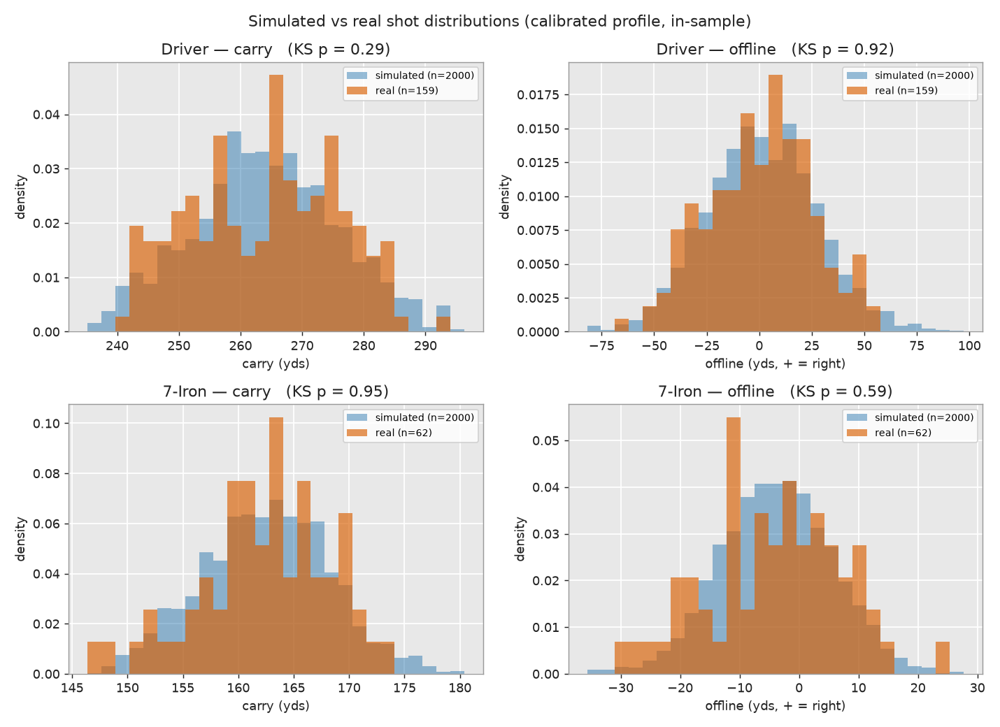
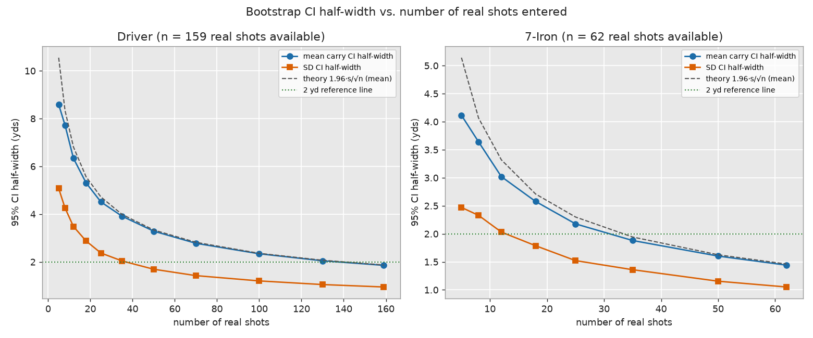
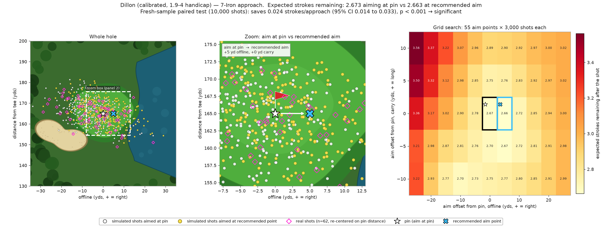
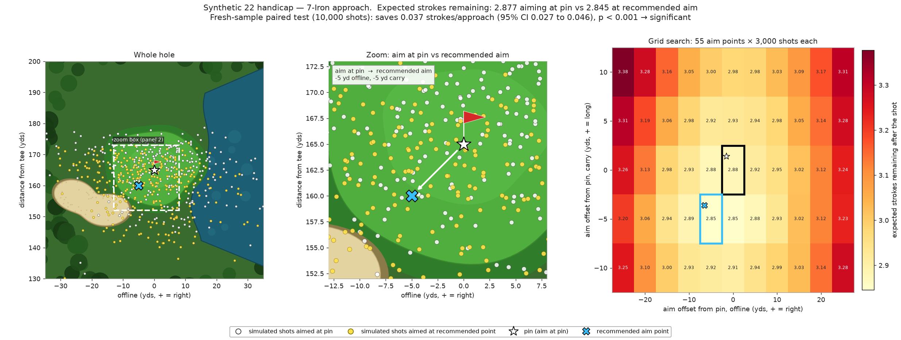
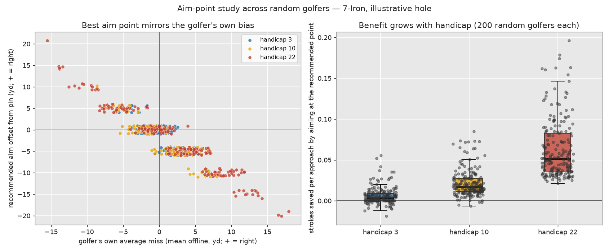

# Golf OS — Shot Pattern Simulator

Golfers consistently underestimate how widely they miss, and then make course-management decisions (which club, where to aim, which tees to play) based on the shot they *hoped* to hit rather than the pattern they actually produce. Fixing that with data requires thousands of shots per player, which no amateur will ever log.

This project is a **shot-dispersion simulator** that generates statistically realistic synthetic shot data, validated against a golfer's real launch-monitor data, so dispersion analytics, tee-box recommendations, and aim-point optimization can be built and tested before real users have logged a single shot. It lives inside **Golf OS**, a Next.js + Supabase golf-tracking app (see [the original app](#the-golf-os-app) below).

**Live app:** [golf-os-ten.vercel.app](https://golf-os-ten.vercel.app)

Built as a school capstone extension by Dillon Cady, a 1.9–4 handicap golfer whose own launch-monitor data calibrates and validates the model. Python and Claude Code were used for the coding.

## What it does

| Piece | What it answers |
|---|---|
| **Synthetic golfer model** (Python) | "Generate realistic shots for a golfer of handicap *H*, or with these carries, or fitted to my real shots." |
| **Statistical validation** | "Do the simulated shots look like real ones, including on sessions the model never saw? How many real shots does a golfer need before a fitted profile can be trusted?" |
| **Aim-point optimizer** | "Given my dispersion and this hole's hazards, is aiming at the pin actually the best strategy, and by how much?" |
| **Browser tools** (`/simulator/*`) | Live dispersion charts, two-golfer comparison, a custom-golfer generator, and a tee-box recommender with real course lookup. |
| **Supabase backend** | Golfer profiles, simulated and real shots, and SQL views for dispersion stats and club-gapping analysis. |

## Key results

### 1. The simulator reproduces real shots, including on unseen sessions

Two-sample Kolmogorov–Smirnov tests on carry and offline distance:

- **In-sample** (profile fit on the same shots): 11 of 11 clubs pass (all p > 0.05).
- **Held out** (profile fit on other sessions, tested on whole sessions it never saw, 5-fold): 7 of 7 testable clubs pass on both carry and offline. Mean carry is within 0.7 yd for every club.
- **Uncalibrated baseline** (a model that only knows "handicap 3"): passes KS on carry for just 3 of 8 clubs (driver 24 yd short). Calibration matters.



> Wedges are the weakest clubs (the 56° is borderline, p ≈ 0.06 held out). This shows the model generalizes across sessions for one golfer, not across golfers. See [Limitations](#limitations).

### 2. How many real shots before the fitted profile means anything?

Bootstrap 95% confidence intervals on mean carry reach ±2 yards at about **35 shots for an iron** and about **140 for the driver**, matching the textbook n ≈ (1.96·s / h)². The driver needs about four times as many shots because its spread is about twice as large. Clubs with fewer than ~15–20 real shots should be treated as low-confidence.



### 3. Where should you aim?

A grid search over 55 aim points (3,000 simulated shots each) on a hole with a bunker front-left and water right, then re-tested on a fresh, paired 10,000-shot sample. Left panel: whole hole. Middle: zoom on the pin versus the recommended aim. Right: expected strokes for every aim point searched.



| Golfer (7-iron) | Aim at pin | Recommended aim | Strokes saved per approach (95% CI) |
|---|---|---|---|
| Calibrated 1.9–4 handicap | 2.673 | 5 yd right of pin, pin high | 0.024 (0.014 – 0.033), p < 0.001 |
| One synthetic 22 handicap | 2.877 | 5 yd left, 5 yd short | 0.037 (0.027 – 0.046), p < 0.001 |

Why does the calibrated golfer aim right? His natural miss is about 4 yd left of the aim line, so aiming 5 yd right re-centers the pattern on the pin (though it puts a bit more ball near the water). The saving is real but small.



A single random golfer is not "the 22 handicap", so the study was repeated for **200 random golfers at each of handicaps 3, 10 and 22**:



- **Benefit grows with handicap:** median saving 0.003, 0.017, 0.051 strokes per approach.
- **Aim direction follows each golfer's own miss bias** (correlation −0.78 to −0.97): aim away from your own miss.

> The hole geometry and stroke costs are **illustrative placeholders**, not a real course or a cited strokes-gained table. "Expected strokes" means strokes *remaining after* the approach shot lands, so it excludes the approach shot itself. The results demonstrate the method and its statistics; they are not yet course-accurate advice. Full numbers: [`STATISTICAL_ANALYSIS.md`](shot-pattern-simulator/STATISTICAL_ANALYSIS.md).

## How the model works

Every shot is built from layered random effects (a small mixed-effects model):

1. **Carry** — a two-piece normal (longer tail on the short side, because mishits come up short far more often than they fly long), scaled by a per-club coefficient of variation.
2. **Mishit mixture** — a handicap-dependent fraction (3–8%) of shots come from a wider distribution and can only lose distance.
3. **Direction, in two physical parts** — `offline = carry × tan(start_line) + curve`. Start line is an angle (scales with club distance); curve is a percentage of carry. This identity matched measured offline distance at r ≈ 0.9998 across three independent datasets.
4. **Curve → carry link** — draws fly farther than fades, which tilts the dispersion ellipse diagonally.
5. **Clamps** — a physical carry ceiling and a smooth exponential-taper floor.
6. **Random effects on start line** — a permanent per-golfer bias, a per-club bias, and a session-level drift.

A golfer can be built from a handicap, a handicap plus a few known carries, a skill tier, or a profile fitted directly to real shots:

```python
SyntheticGolfer.from_handicap(8.5)
SyntheticGolfer.from_handicap_and_carries(8, {"Driver": 250, "7-Iron": 160})
SyntheticGolfer.from_profile_json("reference_data/dillon_profile.json")
```

Parameters are anchored to published sources where they exist (Broadie's Golfmetrics direction-error SDs, TrackMan 2024 Tour carries, GOLFTEC's dispersion-by-handicap study, Shot Scope/Arccos aggregates) and to the author's own launch-monitor data otherwise. The evidence-versus-assumption breakdown is in [`shot-pattern-simulator/HANDOFF.md`](shot-pattern-simulator/HANDOFF.md).

## Repository guide

### Folders

| Folder | What is in it |
|---|---|
| [`shot-pattern-simulator/`](shot-pattern-simulator/) | **The Python project.** The simulator model, calibration, statistical validation, and aim-point analysis. Everything in the research results is produced here. |
| `shot-pattern-simulator/reference_data/` | Input data: the author's real shots (`real_shots.csv`), the fitted profile (`dillon_profile.json`), and a reference synthetic dataset used as a sanity check. |
| `shot-pattern-simulator/output/` | Generated plots and CSVs (git-ignored; recreate by running the scripts). |
| [`app/`](app/) | The Next.js website. `app/simulator/` holds the new pages; `app/api/courses/` proxies the free OpenGolfAPI for course search. The rest is the original Golf OS app. |
| [`components/simulator/`](components/simulator/) | React components: the SVG dispersion canvas, the two-golfer overlay, and the client pages. |
| [`lib/`](lib/) | Tested TypeScript logic: `dispersion/` (yards↔pixels, point-in-polygon, stats), `golfer/` (browser port of the handicap model), `tbox/` (USGA Course Handicap and tee recommendation). |
| [`supabase/`](supabase/) | SQL schemas, analytics views, and example queries. Run manually in the Supabase SQL editor. |
| [`docs/images/`](docs/images/) | The figures shown in this README. |

### Python scripts (in `shot-pattern-simulator/`)

| Script | Purpose | Run it |
|---|---|---|
| `synthetic_golfer.py` | **The model.** The `SyntheticGolfer` class and all calibration tables. About 90% of the project's logic. | imported by the others |
| `generate_shots.py` | Command-line front end: choose a golfer, generate shots to CSV, draw the dispersion plot. | `python generate_shots.py --handicap 8 --carry Driver=250 --n-shots 10000 --show` |
| `menu.py` | Interactive version of the above with numbered prompts; prints the equivalent command. | `python menu.py` |
| `parse_sessions.py` | Turns raw launch-monitor session exports into one tidy shots CSV and flags partial swings. | `python parse_sessions.py "<folder>" --out reference_data/real_shots.csv` |
| `calibrate.py` | Fits the model's parameters from real shots (start line, curve, carry spread, curve→carry slope) into a JSON profile. | `python calibrate.py reference_data/real_shots.csv --out my_profile.json --min-shots 10` |
| `validate_against_reference.py` | Cross-check against an independent reference synthetic dataset (not ground truth). | `python validate_against_reference.py` |
| `statistical_analysis.py` | **Validation suite:** t-test and KS test, bootstrap CIs, power analysis, distribution-overlap figure, held-out (by session) validation, uncalibrated baseline. | `python statistical_analysis.py` |
| `aim_point_optimizer.py` | Grid search of 55 aim points on an illustrative hole, fresh-sample paired confirmation, and the three-panel hole figure. | `python aim_point_optimizer.py` |
| `aim_point_population.py` | Repeats the aim-point study across 200 random golfers at handicaps 3, 10 and 22. | `python aim_point_population.py` |

Detailed numeric results for the last three are in [`STATISTICAL_ANALYSIS.md`](shot-pattern-simulator/STATISTICAL_ANALYSIS.md).

### Web app routes

| Route | Needs seeded Supabase data? |
|---|---|
| `/simulator/custom` — enter a handicap and carries, generate live in the browser | No — runs fully client-side |
| `/simulator` — dispersion charts with polygon QA | Yes |
| `/simulator/compare` — two-golfer overlay + sample-size convergence demo | Yes |
| `/simulator/tbox` — which tee to play, with real course search | Uses your `rounds` table; course search uses a free public API |
| `/simulator/course` — search any course, stand anywhere on a satellite map, see which club to hit | Optional (falls back to a handicap-based golfer); course shapes come from OpenStreetMap |

## Quick start

### Python simulator

```bash
cd shot-pattern-simulator
pip install -r requirements.txt
python menu.py
```

Regenerate every figure and result table:

```bash
python statistical_analysis.py
python aim_point_optimizer.py
python aim_point_population.py
```

### Web app

```bash
npm install
npm test        # 41 unit tests
npm run dev     # http://localhost:3000
```

Create a free [Supabase](https://supabase.com) project and add your keys to `.env.local` (never committed):

```bash
NEXT_PUBLIC_SUPABASE_URL=https://xxxx.supabase.co
NEXT_PUBLIC_SUPABASE_ANON_KEY=your-anon-key
```

Then run the SQL files in [`supabase/`](supabase/) in the Supabase SQL editor. The simulator pages need `simulated_shots_schema.sql`, `real_shots_schema.sql`, and `simulated_shots_views.sql`.

> A one-command seed script is not included yet. The seeded tables were generated from the calibrated profile in `reference_data/dillon_profile.json`.

## Limitations

Stated up front, because they bound what the results can claim:

- **One real golfer.** The calibration and the held-out test use a single player's data (19 full-swing sessions). Data from additional golfers is the highest-value next step. The population aim-point study uses *synthetic* golfers, so it shows how the method behaves, not how real high handicaps behave.
- **"Not rejected" is not "equivalent".** A high p-value means no detected difference, which is weaker than proven equivalence, especially at the 10–20 shot counts for some clubs. Shots within a session are also correlated, so the confidence intervals are somewhat too tight.
- **Mishit behavior is unvalidated.** The mishit rate, severity multiplier, and carry loss have no published source, and range sessions cannot capture on-course duffs.
- **Aim-point results use a placeholder hole and cost model.** Absolute strokes are not meaningful; only the ranking of aim points is.
- **Wedges are the weakest clubs** (borderline in the held-out test; the sand-wedge pattern simulates too round).

## Roadmap

- [ ] Calibration screen — a golfer enters a handful of real shots and watches the fitted pattern shift live
- [ ] Real course hole and hazard geometry, plus a cited strokes-gained cost model, for the aim-point optimizer
- [ ] Course loading and on-course position → club and aim recommendations per handicap
- [ ] A second real golfer's data (across-golfer validation)
- [ ] One-command Supabase seed script

## Data and attribution

- `shot-pattern-simulator/reference_data/real_shots.csv` is the author's own launch-monitor data (589 shots, 13 clubs, 23 sessions, June–August 2026; 451 full swings from 19 sessions are used for calibration).
- Course search uses [OpenGolfAPI](https://opengolfapi.org) (ODbL-licensed) — course data © its contributors.
- The curve/start-line cross-check used a public Kaggle golf-trajectory dataset (~800 shots, handedness not stated).
- Course Handicap follows the USGA formula; the recommended-tee-yardage heuristic is approximate and flagged as unverified in the code.

## License

Released under the [MIT License](LICENSE). Real-shot data and course data carry the attributions listed above.

## The Golf OS app

Golf OS itself is a personal golf practice and performance tracker: practice-session logging with a Club Work section (carry/dispersion/spin per club), a drill library, round tracking with differentials and pressure-collapse flags, and a trends dashboard with CSV export. Built with **Next.js 14** (App Router, TypeScript), **Tailwind CSS**, and **Supabase**, deployed on Vercel.
